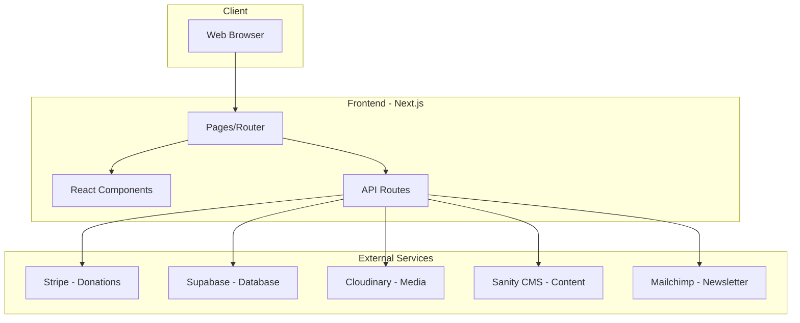
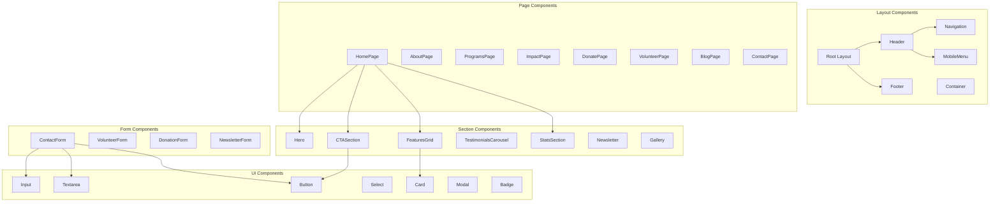
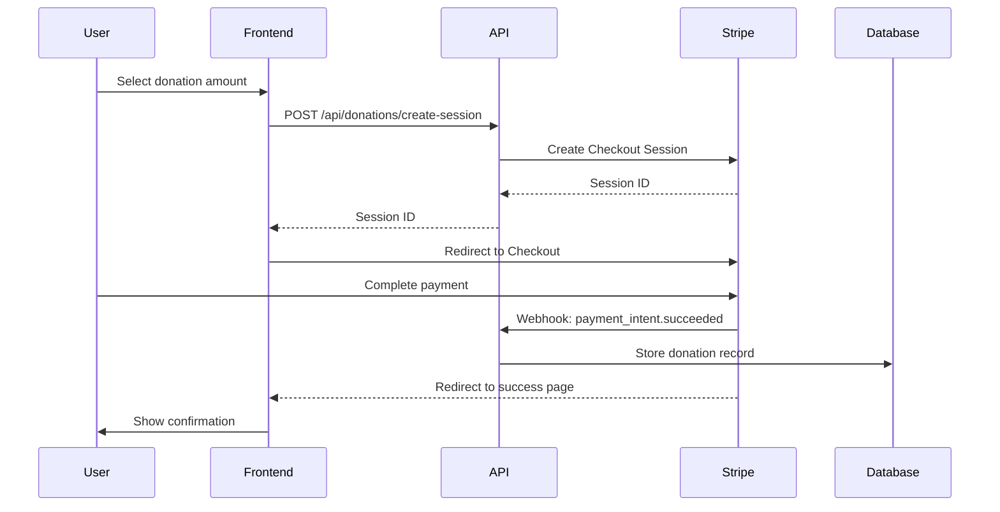
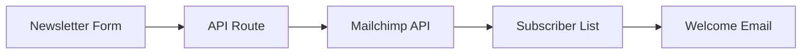
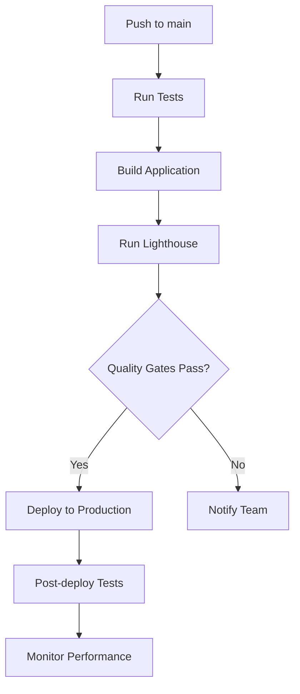

# Restored Kings Foundation Website - Technical Architecture

## Overview

This document outlines the technical architecture for the Restored Kings Foundation website, a nonprofit organization focused on supporting men and boys who are homeless, struggling, or being taken advantage of. The architecture is designed to be scalable, secure, performant, and maintainable while providing an excellent user experience for donors, volunteers, and those seeking help.

---

## 1. Technology Stack Recommendation

### 1.1 Frontend Framework

**Recommendation: Next.js 14+ (React Framework)**

| Technology | Justification |
|------------|---------------|
| **Next.js 14+** | Server-side rendering for SEO, built-in routing, API routes for backend functionality, excellent performance optimizations, and strong TypeScript support |
| **React 18+** | Component-based architecture, vast ecosystem, excellent for interactive UI elements like donation forms |
| **TypeScript** | Type safety, better developer experience, reduced runtime errors, improved maintainability |

### 1.2 CSS Approach

**Recommendation: Tailwind CSS with CSS Variables for theming**

| Technology | Justification |
|------------|---------------|
| **Tailwind CSS** | Utility-first approach for rapid development, excellent responsive design utilities, small production bundle, highly customizable |
| **CSS Variables** | Runtime theming capability, easy maintenance of design tokens, supports dark mode if needed |
| **PostCSS** | Required by Tailwind, enables additional CSS optimizations |

### 1.3 Build Tools

| Tool | Purpose |
|------|---------|
| **Turbopack** | Next.js 14+ bundler for faster development builds |
| **ESLint** | Code quality and consistency |
| **Prettier** | Code formatting |
| **Husky** | Git hooks for pre-commit checks |

### 1.4 Backend Requirements

**Recommendation: Next.js API Routes with External Services**

| Component | Technology | Purpose |
|-----------|------------|---------|
| **API Layer** | Next.js API Routes | Serverless functions for form handling, contact submissions, newsletter signups |
| **Database** | Supabase (PostgreSQL) | User data, blog content, donation records, volunteer applications |
| **Authentication** | NextAuth.js | Admin panel authentication |
| **File Storage** | Cloudinary or Supabase Storage | Image and video hosting for gallery, blog media |
| **CMS** | Sanity.io or Payload CMS | Content management for blog, success stories, program information |

### 1.5 Architecture Diagram



---

## 2. Project File Structure

### 2.1 Directory Structure

```
restored-kings-foundation/
├── .github/
│   └── workflows/
│       ├── ci.yml
│       └── deploy.yml
├── .husky/
│   ├── pre-commit
│   └── pre-push
├── public/
│   ├── favicon.ico
│   ├── robots.txt
│   ├── sitemap.xml
│   ├── manifest.json
│   ├── images/
│   │   ├── og-image.jpg
│   │   └── logo.svg
│   └── fonts/
├── src/
│   ├── app/
│   │   ├── layout.tsx
│   │   ├── page.tsx
│   │   ├── globals.css
│   │   ├── about/
│   │   │   └── page.tsx
│   │   ├── programs/
│   │   │   └── page.tsx
│   │   ├── impact/
│   │   │   └── page.tsx
│   │   ├── donate/
│   │   │   ├── page.tsx
│   │   │   ├── success/
│   │   │   │   └── page.tsx
│   │   │   └── cancel/
│   │   │       └── page.tsx
│   │   ├── volunteer/
│   │   │   └── page.tsx
│   │   ├── blog/
│   │   │   ├── page.tsx
│   │   │   └── [slug]/
│   │   │       └── page.tsx
│   │   ├── contact/
│   │   │   └── page.tsx
│   │   ├── privacy-policy/
│   │   │   └── page.tsx
│   │   └── admin/
│   │       ├── layout.tsx
│   │       ├── page.tsx
│   │       ├── blog/
│   │       ├── stories/
│   │       └── media/
│   ├── components/
│   │   ├── ui/
│   │   │   ├── Button.tsx
│   │   │   ├── Card.tsx
│   │   │   ├── Input.tsx
│   │   │   ├── Select.tsx
│   │   │   ├── Textarea.tsx
│   │   │   ├── Modal.tsx
│   │   │   ├── Badge.tsx
│   │   │   ├── Skeleton.tsx
│   │   │   └── index.ts
│   │   ├── layout/
│   │   │   ├── Header.tsx
│   │   │   ├── Footer.tsx
│   │   │   ├── Navigation.tsx
│   │   │   ├── MobileMenu.tsx
│   │   │   └── Container.tsx
│   │   ├── sections/
│   │   │   ├── Hero.tsx
│   │   │   ├── CTASection.tsx
│   │   │   ├── FeaturesGrid.tsx
│   │   │   ├── TestimonialsCarousel.tsx
│   │   │   ├── StatsSection.tsx
│   │   │   ├── Newsletter.tsx
│   │   │   └── Gallery.tsx
│   │   ├── forms/
│   │   │   ├── ContactForm.tsx
│   │   │   ├── VolunteerForm.tsx
│   │   │   ├── DonationForm.tsx
│   │   │   └── NewsletterForm.tsx
│   │   ├── blog/
│   │   │   ├── BlogCard.tsx
│   │   │   ├── BlogList.tsx
│   │   │   └── BlogPost.tsx
│   │   └── shared/
│   │       ├── Logo.tsx
│   │       ├── SocialLinks.tsx
│   │       ├── Breadcrumbs.tsx
│   │       └── SEOHead.tsx
│   ├── lib/
│   │   ├── api/
│   │   │   ├── donations.ts
│   │   │   ├── contact.ts
│   │   │   ├── newsletter.ts
│   │   │   └── blog.ts
│   │   ├── stripe/
│   │   │   ├── client.ts
│   │   │   └── config.ts
│   │   ├── supabase/
│   │   │   ├── client.ts
│   │   │   └── server.ts
│   │   ├── cms/
│   │   │   └── sanity.ts
│   │   ├── analytics/
│   │   │   └── index.ts
│   │   └── utils/
│   │       ├── cn.ts
│   │       ├── formatDate.ts
│   │       └── validators.ts
│   ├── hooks/
│   │   ├── useMediaQuery.ts
│   │   ├── useScrollPosition.ts
│   │   ├── useIntersectionObserver.ts
│   │   └── useToast.ts
│   ├── context/
│   │   ├── ThemeContext.tsx
│   │   └── ToastContext.tsx
│   ├── types/
│   │   ├── api.ts
│   │   ├── donation.ts
│   │   ├── blog.ts
│   │   └── forms.ts
│   ├── constants/
│   │   ├── navigation.ts
│   │   ├── social-links.ts
│   │   └── donation-amounts.ts
│   └── config/
│       ├── site.ts
│       └── seo.ts
├── tests/
│   ├── e2e/
│   │   ├── donation.spec.ts
│   │   ├── contact.spec.ts
│   │   └── navigation.spec.ts
│   └── unit/
│       └── components/
├── docs/
│   ├── ARCHITECTURE.md
│   ├── DEPLOYMENT.md
│   └── CONTRIBUTING.md
├── .env.local.example
├── .eslintrc.json
├── .prettierrc
├── next.config.js
├── tailwind.config.ts
├── tsconfig.json
├── package.json
└── README.md
```

### 2.2 Asset Organization

```
public/
├── images/
│   ├── hero/
│   │   └── hero-background.jpg
│   ├── about/
│   │   ├── founder.jpg
│   │   └── team/
│   ├── programs/
│   │   ├── outreach.jpg
│   │   ├── mentorship.jpg
│   │   └── workshops.jpg
│   ├── impact/
│   │   └── success-stories/
│   ├── blog/
│   │   └── posts/
│   ├── icons/
│   │   ├── donate.svg
│   │   ├── volunteer.svg
│   │   └── help.svg
│   └── partners/
│       └── logos/
├── videos/
│   └── promotional/
└── documents/
    ├── annual-report.pdf
    └── privacy-policy.pdf
```

---

## 3. Component Architecture

### 3.1 Component Hierarchy



### 3.2 Reusable Components List

#### UI Components - Atomic Level

| Component | Props | Description |
|-----------|-------|-------------|
| `Button` | variant, size, disabled, loading, onClick, children | Primary CTA component with variants: primary, secondary, outline, ghost |
| `Card` | variant, padding, hover, children | Container for content with optional hover effects |
| `Input` | type, label, error, helperText, required | Form input with label and error handling |
| `Select` | options, label, error, placeholder | Dropdown select component |
| `Textarea` | label, error, rows, maxLength | Multi-line text input |
| `Modal` | isOpen, onClose, title, size | Overlay dialog for confirmations and forms |
| `Badge` | variant, size, children | Status indicators and labels |
| `Skeleton` | variant, width, height | Loading placeholder |
| `Spinner` | size, color | Loading indicator |
| `Toast` | type, message, duration | Notification messages |

#### Layout Components

| Component | Props | Description |
|-----------|-------|-------------|
| `Header` | transparent, sticky | Site header with navigation and CTA |
| `Footer` | - | Site footer with links, social, newsletter |
| `Navigation` | items, activeItem | Desktop navigation menu |
| `MobileMenu` | isOpen, onClose | Mobile hamburger menu |
| `Container` | size, centered | Max-width container with responsive padding |
| `Section` | background, padding, id | Page section wrapper |

#### Section Components

| Component | Props | Description |
|-----------|-------|-------------|
| `Hero` | title, subtitle, backgroundImage, ctas | Full-width hero section |
| `CTASection` | title, description, buttons, background | Call-to-action banner |
| `FeaturesGrid` | features, columns | Grid of feature cards |
| `TestimonialsCarousel` | testimonials, autoPlay | Carousel of testimonials |
| `StatsSection` | stats, title | Animated statistics display |
| `Newsletter` | title, description | Newsletter signup section |
| `Gallery` | images, videos, columns | Photo and video gallery grid |
| `TeamSection` | members | Team/founder display |

#### Form Components

| Component | Props | Description |
|-----------|-------|-------------|
| `ContactForm` | onSubmit | Contact form with validation |
| `VolunteerForm` | onSubmit, areas | Volunteer application form |
| `DonationForm` | onSuccess, amounts | Donation form with Stripe integration |
| `NewsletterForm` | onSubmit | Email signup form |

### 3.3 Page Components Structure

Each page follows a consistent structure:

```typescript
// Example: About Page Structure
interface AboutPageProps {
  // Page-specific data from CMS
}

const AboutPage: React.FC<AboutPageProps> = async () => {
  const data = await fetchAboutData();
  
  return (
    <>
      <SEOHead {...seoConfig} />
      <Hero variant="page" title="About Us" />
      <Section id="mission">
        <MissionSection data={data.mission} />
      </Section>
      <Section id="vision">
        <VisionSection data={data.vision} />
      </Section>
      <Section id="founder">
        <FounderSection data={data.founder} />
      </Section>
      <Section id="values">
        <ValuesGrid values={data.values} />
      </Section>
      <CTASection />
    </>
  );
};
```

---

## 4. Design System Foundation

### 4.1 Color Palette

#### Primary Colors - Strength and Dignity

| Color Name | Hex Code | RGB | Usage |
|------------|----------|-----|-------|
| **Deep Blue** | `#1E3A5F` | rgb(30, 58, 95) | Primary brand color, headers, navigation |
| **Royal Blue** | `#2C5282` | rgb(44, 82, 130) | Hover states, secondary elements |
| **Light Blue** | `#4A90D9` | rgb(74, 144, 217) | Links, accents, highlights |

#### Secondary Colors - Warmth and Hope

| Color Name | Hex Code | RGB | Usage |
|------------|----------|-----|-------|
| **Gold** | `#D4A84B` | rgb(212, 168, 75) | CTAs, highlights, accents |
| **Light Gold** | `#E8C97B` | rgb(232, 201, 123) | Hover states for gold elements |
| **Dark Gold** | `#B8923D` | rgb(184, 146, 61) | Active states |

#### Neutral Colors

| Color Name | Hex Code | RGB | Usage |
|------------|----------|-----|-------|
| **Charcoal** | `#2D3748` | rgb(45, 55, 72) | Body text, dark backgrounds |
| **Slate** | `#4A5568` | rgb(74, 85, 104) | Secondary text |
| **Gray** | `#718096` | rgb(113, 128, 150) | Muted text, borders |
| **Light Gray** | `#E2E8F0` | rgb(226, 232, 240) | Backgrounds, dividers |
| **Off White** | `#F7FAFC` | rgb(247, 250, 252) | Page backgrounds |
| **White** | `#FFFFFF` | rgb(255, 255, 255) | Cards, content areas |

#### Semantic Colors

| Color Name | Hex Code | Usage |
|------------|----------|-------|
| **Success** | `#38A169` | Success messages, positive stats |
| **Warning** | `#DD6B20` | Warning messages |
| **Error** | `#E53E3E` | Error messages, form validation |
| **Info** | `#3182CE` | Informational messages |

#### CSS Variables Implementation

```css
:root {
  /* Primary */
  --color-primary-900: #1E3A5F;
  --color-primary-700: #2C5282;
  --color-primary-500: #4A90D9;
  
  /* Secondary */
  --color-secondary-500: #D4A84B;
  --color-secondary-400: #E8C97B;
  --color-secondary-600: #B8923D;
  
  /* Neutrals */
  --color-neutral-900: #2D3748;
  --color-neutral-700: #4A5568;
  --color-neutral-500: #718096;
  --color-neutral-200: #E2E8F0;
  --color-neutral-100: #F7FAFC;
  --color-white: #FFFFFF;
  
  /* Semantic */
  --color-success: #38A169;
  --color-warning: #DD6B20;
  --color-error: #E53E3E;
  --color-info: #3182CE;
}
```

### 4.2 Typography

#### Font Families

| Usage | Font | Fallback |
|-------|------|----------|
| **Headings** | Inter or Montserrat | system-ui, sans-serif |
| **Body** | Inter or Open Sans | system-ui, sans-serif |
| **Accent/Display** | Playfair Display | Georgia, serif |

#### Type Scale

| Element | Size | Weight | Line Height | Letter Spacing |
|---------|------|--------|-------------|----------------|
| **H1** | 3rem (48px) | 700 | 1.2 | -0.02em |
| **H2** | 2.25rem (36px) | 700 | 1.25 | -0.01em |
| **H3** | 1.875rem (30px) | 600 | 1.3 | 0 |
| **H4** | 1.5rem (24px) | 600 | 1.4 | 0 |
| **H5** | 1.25rem (20px) | 600 | 1.4 | 0 |
| **H6** | 1rem (16px) | 600 | 1.5 | 0 |
| **Body Large** | 1.125rem (18px) | 400 | 1.6 | 0 |
| **Body** | 1rem (16px) | 400 | 1.6 | 0 |
| **Body Small** | 0.875rem (14px) | 400 | 1.5 | 0 |
| **Caption** | 0.75rem (12px) | 400 | 1.4 | 0.02em |
| **Button** | 1rem (16px) | 600 | 1 | 0.02em |

#### Tailwind Typography Config

```typescript
// tailwind.config.ts
const typography = {
  fontFamily: {
    heading: ['Inter', 'system-ui', 'sans-serif'],
    body: ['Inter', 'system-ui', 'sans-serif'],
    display: ['Playfair Display', 'Georgia', 'serif'],
  },
  fontSize: {
    'display-1': ['3.5rem', { lineHeight: '1.1', letterSpacing: '-0.02em' }],
    'display-2': ['3rem', { lineHeight: '1.2', letterSpacing: '-0.02em' }],
    'heading-1': ['2.5rem', { lineHeight: '1.2', letterSpacing: '-0.01em' }],
    'heading-2': ['2rem', { lineHeight: '1.25', letterSpacing: '-0.01em' }],
    'heading-3': ['1.5rem', { lineHeight: '1.3' }],
    'heading-4': ['1.25rem', { lineHeight: '1.4' }],
    'body-lg': ['1.125rem', { lineHeight: '1.6' }],
    'body': ['1rem', { lineHeight: '1.6' }],
    'body-sm': ['0.875rem', { lineHeight: '1.5' }],
    'caption': ['0.75rem', { lineHeight: '1.4', letterSpacing: '0.02em' }],
  },
};
```

### 4.3 Spacing System

Based on 4px base unit (0.25rem):

| Token | Value | Pixels | Usage |
|-------|-------|--------|-------|
| `space-0` | 0 | 0px | No spacing |
| `space-1` | 0.25rem | 4px | Tight spacing, icon gaps |
| `space-2` | 0.5rem | 8px | Small gaps, inline spacing |
| `space-3` | 0.75rem | 12px | Medium-small gaps |
| `space-4` | 1rem | 16px | Default gaps, padding |
| `space-5` | 1.25rem | 20px | Comfortable gaps |
| `space-6` | 1.5rem | 24px | Section internal padding |
| `space-8` | 2rem | 32px | Section padding |
| `space-10` | 2.5rem | 40px | Large section gaps |
| `space-12` | 3rem | 48px | Section margins |
| `space-16` | 4rem | 64px | Large section spacing |
| `space-20` | 5rem | 80px | Page section gaps |
| `space-24` | 6rem | 96px | Major section gaps |

### 4.4 Breakpoints

| Breakpoint | Min Width | Target Devices |
|------------|-----------|----------------|
| `sm` | 640px | Large phones, landscape |
| `md` | 768px | Tablets |
| `lg` | 1024px | Small laptops, large tablets |
| `xl` | 1280px | Desktops |
| `2xl` | 1536px | Large desktops |

#### Container Max Widths

| Breakpoint | Container Width |
|------------|-----------------|
| `sm` | 640px |
| `md` | 768px |
| `lg` | 1024px |
| `xl` | 1280px |
| `2xl` | 1400px |

### 4.5 Shadow System

```css
:root {
  --shadow-sm: 0 1px 2px 0 rgb(0 0 0 / 0.05);
  --shadow-md: 0 4px 6px -1px rgb(0 0 0 / 0.1), 0 2px 4px -2px rgb(0 0 0 / 0.1);
  --shadow-lg: 0 10px 15px -3px rgb(0 0 0 / 0.1), 0 4px 6px -4px rgb(0 0 0 / 0.1);
  --shadow-xl: 0 20px 25px -5px rgb(0 0 0 / 0.1), 0 8px 10px -6px rgb(0 0 0 / 0.1);
  --shadow-card: 0 4px 20px rgb(30 58 95 / 0.1);
  --shadow-card-hover: 0 8px 30px rgb(30 58 95 / 0.15);
}
```

### 4.6 Border Radius

| Token | Value | Usage |
|-------|-------|-------|
| `rounded-none` | 0 | Sharp corners |
| `rounded-sm` | 0.125rem | Subtle rounding |
| `rounded` | 0.25rem | Default rounding |
| `rounded-md` | 0.375rem | Buttons, inputs |
| `rounded-lg` | 0.5rem | Cards |
| `rounded-xl` | 0.75rem | Large cards, modals |
| `rounded-2xl` | 1rem | Feature cards |
| `rounded-full` | 9999px | Pills, avatars |

---

## 5. Third-party Integrations

### 5.1 Donation Processing - Stripe

#### Implementation Approach



#### Stripe Integration Components

| Component | Description |
|-----------|-------------|
| **Stripe Checkout** | Hosted payment page for secure transactions |
| **Stripe Elements** | Custom payment form if needed |
| **Stripe Webhooks** | Server-side event handling for payment confirmation |
| **Stripe Customer Portal** | For managing recurring donations |

#### Donation Features

- One-time donations with custom amounts
- Recurring donations (monthly, quarterly, annually)
- Donation levels with suggested amounts
- Donor information collection
- Tax receipt email automation
- Donation history for registered users

### 5.2 Form Handling

#### Contact Form

| Field | Type | Required | Validation |
|-------|------|----------|------------|
| Name | Text | Yes | Min 2 chars |
| Email | Email | Yes | Valid email format |
| Phone | Tel | No | Valid phone format |
| Subject | Select | Yes | Predefined options |
| Message | Textarea | Yes | Min 10 chars |

#### Volunteer Application Form

| Field | Type | Required | Validation |
|-------|------|----------|------------|
| Personal Info | Group | Yes | Name, email, phone |
| Availability | Select | Yes | Days/times available |
| Areas of Interest | Multi-select | Yes | Program areas |
| Experience | Textarea | No | Relevant experience |
| References | Group | No | 2 reference contacts |
| Background Check | Checkbox | Yes | Consent required |

#### Form Backend - API Routes

```typescript
// /api/contact/route.ts
// /api/volunteer/route.ts
// /api/newsletter/route.ts
```

All forms will:
- Validate on client and server
- Implement rate limiting
- Send confirmation emails
- Store submissions in database
- Notify admin team

### 5.3 Analytics Setup

#### Google Analytics 4

| Event | Category | Description |
|-------|----------|-------------|
| `page_view` | Engagement | All page views |
| `donation_started` | Conversion | Donation form initiated |
| `donation_completed` | Conversion | Successful donation |
| `form_submission` | Engagement | Any form submitted |
| `cta_click` | Engagement | CTA button clicks |
| `video_play` | Engagement | Video interactions |

#### Enhanced Ecommerce for Donations

```typescript
// Donation tracking event
gtag('event', 'purchase', {
  transaction_id: donationId,
  value: amount,
  currency: 'USD',
  items: [{
    item_name: 'Donation',
    item_category: donationType, // one-time/recurring
    price: amount,
    quantity: 1
  }]
});
```

#### Additional Analytics

| Tool | Purpose |
|------|---------|
| **Google Search Console** | SEO monitoring |
| **Hotjar or Clarity** | User behavior, heatmaps |
| **Sentry** | Error tracking and monitoring |

### 5.4 Newsletter Integration - Mailchimp

#### Implementation



#### Features

- Single opt-in with confirmation email
- Interest group selection (volunteer opportunities, events, general updates)
- GDPR-compliant consent tracking
- Unsubscribe handling
- Integration with donation thank you emails

### 5.5 CMS Integration - Sanity.io

#### Content Types

| Schema | Fields | Description |
|--------|--------|-------------|
| **Blog Post** | title, slug, excerpt, content, author, publishedAt, featuredImage, categories | Blog articles |
| **Success Story** | name, photo, story, program, date | Impact testimonials |
| **Program** | title, description, image, schedule, contact | Programs and services |
| **Team Member** | name, role, bio, photo, email | Team/founder info |
| **Event** | title, date, location, description, image | Events and activities |
| **Site Settings** | logo, social links, contact info, SEO defaults | Global settings |

### 5.6 Social Media Integration

| Platform | Integration |
|----------|-------------|
| **Facebook** | Share button, page feed embed, pixel tracking |
| **Instagram** | Feed embed, share button |
| **Twitter/X** | Share button, meta tags |
| **LinkedIn** | Share button, company page link |
| **YouTube** | Video embeds, channel link |

---

## 6. SEO Strategy

### 6.1 Meta Tag Structure

#### Primary Meta Tags

```html
<title>{page.title} | Restored Kings Foundation</title>
<meta name="description" content="{page.description}" />
<meta name="keywords" content="{page.keywords}" />
<meta name="author" content="Restored Kings Foundation" />
<meta name="robots" content="index, follow" />
<link rel="canonical" href="https://restoredkings.org{page.path}" />
```

#### Open Graph Tags

```html
<meta property="og:type" content="website" />
<meta property="og:url" content="https://restoredkings.org{page.path}" />
<meta property="og:title" content="{page.title} | Restored Kings Foundation" />
<meta property="og:description" content="{page.description}" />
<meta property="og:image" content="{page.ogImage}" />
<meta property="og:image:width" content="1200" />
<meta property="og:image:height" content="630" />
<meta property="og:site_name" content="Restored Kings Foundation" />
<meta property="og:locale" content="en_US" />
```

#### Twitter Card Tags

```html
<meta name="twitter:card" content="summary_large_image" />
<meta name="twitter:site" content="@restoredkings" />
<meta name="twitter:title" content="{page.title}" />
<meta name="twitter:description" content="{page.description}" />
<meta name="twitter:image" content="{page.ogImage}" />
```

### 6.2 Schema Markup Recommendations

#### Organization Schema

```json
{
  "@context": "https://schema.org",
  "@type": "NonprofitOrganization",
  "name": "Restored Kings Foundation",
  "url": "https://restoredkings.org",
  "logo": "https://restoredkings.org/images/logo.png",
  "description": "Supporting men and boys who are homeless, struggling, or being taken advantage of through support, education, mentorship, and community activities.",
  "address": {
    "@type": "PostalAddress",
    "streetAddress": "{address}",
    "addressLocality": "{city}",
    "addressRegion": "{state}",
    "postalCode": "{zip}",
    "addressCountry": "US"
  },
  "contactPoint": {
    "@type": "ContactPoint",
    "telephone": "{phone}",
    "contactType": "customer service",
    "availableLanguage": "English"
  },
  "sameAs": [
    "https://facebook.com/restoredkings",
    "https://twitter.com/restoredkings",
    "https://instagram.com/restoredkings",
    "https://linkedin.com/company/restoredkings"
  ]
}
```

#### Local Business Schema

```json
{
  "@context": "https://schema.org",
  "@type": "LocalBusiness",
  "name": "Restored Kings Foundation",
  "image": "https://restoredkings.org/images/office.jpg",
  "geo": {
    "@type": "GeoCoordinates",
    "latitude": "{lat}",
    "longitude": "{lng}"
  },
  "openingHours": "Mo-Fr 09:00-17:00"
}
```

#### Article Schema (Blog Posts)

```json
{
  "@context": "https://schema.org",
  "@type": "Article",
  "headline": "{article.title}",
  "image": "{article.featuredImage}",
  "author": {
    "@type": "Person",
    "name": "{author.name}"
  },
  "publisher": {
    "@type": "Organization",
    "name": "Restored Kings Foundation",
    "logo": {
      "@type": "ImageObject",
      "url": "https://restoredkings.org/images/logo.png"
    }
  },
  "datePublished": "{article.publishedAt}",
  "dateModified": "{article.updatedAt}"
}
```

#### FAQ Schema (For FAQ Sections)

```json
{
  "@context": "https://schema.org",
  "@type": "FAQPage",
  "mainEntity": [
    {
      "@type": "Question",
      "name": "How can I get help?",
      "acceptedAnswer": {
        "@type": "Answer",
        "text": "{answer}"
      }
    }
  ]
}
```

#### Breadcrumb Schema

```json
{
  "@context": "https://schema.org",
  "@type": "BreadcrumbList",
  "itemListElement": [
    {
      "@type": "ListItem",
      "position": 1,
      "name": "Home",
      "item": "https://restoredkings.org"
    },
    {
      "@type": "ListItem",
      "position": 2,
      "name": "{page.title}",
      "item": "https://restoredkings.org{page.path}"
    }
  ]
}
```

### 6.3 URL Structure

| Page | URL Path | Description |
|------|----------|-------------|
| Home | `/` | Landing page |
| About | `/about` | About the organization |
| Programs | `/programs` | Programs overview |
| Program Detail | `/programs/[slug]` | Individual program page |
| Impact | `/impact` | Success stories and statistics |
| Donate | `/donate` | Donation page |
| Volunteer | `/volunteer` | Volunteer information and signup |
| Blog | `/blog` | Blog listing |
| Blog Post | `/blog/[slug]` | Individual blog post |
| Contact | `/contact` | Contact information and form |
| Privacy Policy | `/privacy-policy` | Legal page |

#### URL Best Practices

- Lowercase only
- Hyphen-separated words
- No trailing slashes
- Meaningful, descriptive slugs
- No query parameters for content pages
- Redirect old URLs if migrating

### 6.4 Technical SEO Checklist

| Item | Implementation |
|------|----------------|
| **Sitemap** | Auto-generated sitemap.xml at build time |
| **Robots.txt** | Allow all, reference sitemap |
| **SSL/HTTPS** | Enforce HTTPS redirect |
| **Core Web Vitals** | Target LCP < 2.5s, FID < 100ms, CLS < 0.1 |
| **Image Optimization** | Next.js Image component with WebP/AVIF |
| **Lazy Loading** | Images and videos below fold |
| **Preconnect** | External domains (Stripe, analytics) |
| **Font Loading** | font-display: swap |
| **Canonical URLs** | Self-referencing canonical tags |
| **Hreflang** | If multi-language in future |

### 6.5 SEO Component Implementation

```typescript
// src/components/shared/SEOHead.tsx
interface SEOHeadProps {
  title: string;
  description: string;
  path: string;
  ogImage?: string;
  article?: {
    publishedAt: string;
    author: string;
  };
}

const SEOHead: React.FC<SEOHeadProps> = ({ 
  title, 
  description, 
  path, 
  ogImage,
  article 
}) => {
  // Implementation with next/head or metadata API
};
```

---

## 7. Security Considerations

### 7.1 Authentication & Authorization

| Feature | Implementation |
|---------|----------------|
| **Admin Auth** | NextAuth.js with secure session management |
| **Password Policy** | Minimum 12 chars, complexity requirements |
| **2FA** | Optional TOTP for admin accounts |
| **Session Management** | JWT with short expiry, refresh tokens |
| **CSRF Protection** | Built-in Next.js CSRF protection |

### 7.2 Data Protection

| Concern | Solution |
|---------|----------|
| **Donor Data** | Encrypted at rest, PCI compliance via Stripe |
| **Form Submissions** | Rate limiting, CAPTCHA for public forms |
| **PII Handling** | Minimal data collection, secure deletion policies |
| **Cookie Consent** | GDPR/CCPA compliant consent banner |

### 7.3 Security Headers

```typescript
// next.config.js
const securityHeaders = [
  { key: 'X-DNS-Prefetch-Control', value: 'on' },
  { key: 'X-XSS-Protection', value: '1; mode=block' },
  { key: 'X-Frame-Options', value: 'SAMEORIGIN' },
  { key: 'X-Content-Type-Options', value: 'nosniff' },
  { key: 'Referrer-Policy', value: 'origin-when-cross-origin' },
  { key: 'Permissions-Policy', value: 'camera=(), microphone=(), geolocation=()' },
];
```

---

## 8. Performance Optimization

### 8.1 Frontend Performance

| Strategy | Implementation |
|----------|----------------|
| **Code Splitting** | Dynamic imports for heavy components |
| **Image Optimization** | Next.js Image with blur placeholders |
| **Font Optimization** | Subset fonts, preload critical fonts |
| **Bundle Analysis** | Regular bundle size monitoring |
| **Tree Shaking** | ES modules, avoid barrel exports |

### 8.2 Caching Strategy

| Resource | Cache Strategy |
|----------|----------------|
| **Static Pages** | ISR with 1-hour revalidation |
| **Blog Content** | ISR with 10-minute revalidation |
| **Images** | CDN cache, 1 year expiry |
| **API Responses** | SWR with stale-while-revalidate |
| **Static Assets** | Immutable cache with content hash |

### 8.3 Performance Budget

| Metric | Target |
|--------|--------|
| **Lighthouse Performance** | > 90 |
| **First Contentful Paint** | < 1.5s |
| **Largest Contentful Paint** | < 2.5s |
| **Time to Interactive** | < 3.5s |
| **Total Bundle Size** | < 200KB (gzipped) |
| **Image Size** | < 500KB per page |

---

## 9. Deployment Architecture

### 9.1 Hosting Recommendation

**Primary: Vercel**

| Feature | Benefit |
|---------|---------|
| **Edge Network** | Global CDN for fast delivery |
| **Serverless Functions** | API routes without server management |
| **Preview Deployments** | Branch previews for testing |
| **Analytics** | Built-in performance monitoring |
| **Auto SSL** | Automatic HTTPS |

### 9.2 CI/CD Pipeline



### 9.3 Environment Configuration

| Environment | Purpose |
|-------------|---------|
| **Development** | Local development with hot reload |
| **Preview** | Branch deployments for review |
| **Staging** | Pre-production testing |
| **Production** | Live site |

---

## 10. Monitoring & Maintenance

### 10.1 Monitoring Setup

| Tool | Purpose |
|------|---------|
| **Vercel Analytics** | Performance and traffic monitoring |
| **Sentry** | Error tracking and alerting |
| **Uptime Robot** | Availability monitoring |
| **Google Search Console** | SEO health monitoring |

### 10.2 Backup Strategy

| Data | Backup Method | Frequency |
|------|---------------|-----------|
| **Database** | Automated Supabase backups | Daily |
| **Media Files** | Cloudinary backup | Continuous |
| **CMS Content** | Sanity export | Weekly |
| **Code** | Git repository | Continuous |

---

## 11. Future Considerations

### 11.1 Scalability

- Multi-language support (i18n)
- Event registration system
- Member portal with donation history
- Volunteer scheduling system
- Online courses/learning platform

### 11.2 Integration Opportunities

- CRM integration (Salesforce Nonprofit)
- Email marketing automation
- Grant management system
- Volunteer management platform

---

## Appendix A: Environment Variables

```bash
# .env.local.example

# Site Configuration
NEXT_PUBLIC_SITE_URL=https://restoredkings.org
NEXT_PUBLIC_SITE_NAME=Restored Kings Foundation

# Stripe
STRIPE_SECRET_KEY=sk_live_xxx
STRIPE_PUBLISHABLE_KEY=pk_live_xxx
STRIPE_WEBHOOK_SECRET=whsec_xxx

# Database
SUPABASE_URL=https://xxx.supabase.co
SUPABASE_ANON_KEY=xxx
SUPABASE_SERVICE_ROLE_KEY=xxx

# CMS
SANITY_PROJECT_ID=xxx
SANITY_DATASET=production
SANITY_API_TOKEN=xxx

# Authentication
NEXTAUTH_SECRET=xxx
NEXTAUTH_URL=https://restoredkings.org

# Email/Newsletter
MAILCHIMP_API_KEY=xxx
MAILCHIMP_LIST_ID=xxx

# Analytics
NEXT_PUBLIC_GA_ID=G-xxx
NEXT_PUBLIC_HOTJAR_ID=xxx

# Error Tracking
SENTRY_DSN=xxx

# Social Media
NEXT_PUBLIC_FACEBOOK_PIXEL_ID=xxx
```

---

## Appendix B: Recommended npm Packages

```json
{
  "dependencies": {
    "next": "^14.0.0",
    "react": "^18.2.0",
    "react-dom": "^18.2.0",
    "@stripe/stripe-js": "^2.0.0",
    "@stripe/react-stripe-js": "^2.0.0",
    "@supabase/supabase-js": "^2.0.0",
    "@sanity/client": "^6.0.0",
    "next-sanity": "^5.0.0",
    "next-auth": "^4.24.0",
    "tailwindcss": "^3.4.0",
    "clsx": "^2.0.0",
    "tailwind-merge": "^2.0.0",
    "react-hook-form": "^7.48.0",
    "zod": "^3.22.0",
    "@hookform/resolvers": "^3.3.0",
    "framer-motion": "^10.16.0",
    "react-intersection-observer": "^9.5.0",
    "date-fns": "^2.30.0",
    "next-seo": "^6.1.0",
    "@next/third-parties": "^14.0.0"
  },
  "devDependencies": {
    "typescript": "^5.3.0",
    "@types/react": "^18.2.0",
    "@types/node": "^20.10.0",
    "eslint": "^8.55.0",
    "eslint-config-next": "^14.0.0",
    "prettier": "^3.1.0",
    "prettier-plugin-tailwindcss": "^0.5.0",
    "@playwright/test": "^1.40.0",
    "husky": "^8.0.0",
    "lint-staged": "^15.1.0"
  }
}
```

---

*Document Version: 1.0*  
*Last Updated: February 2026*  
*Author: Architecture Team*