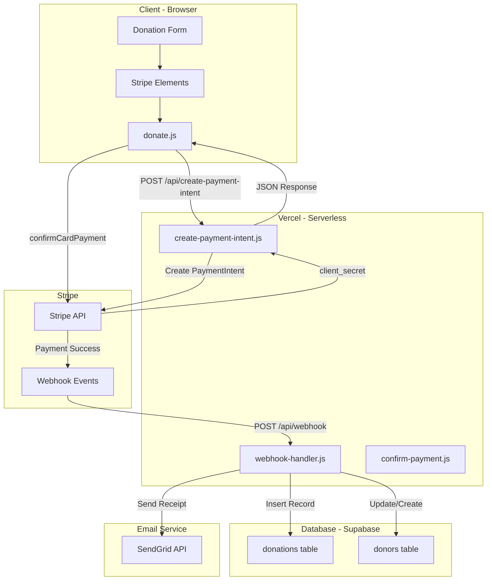
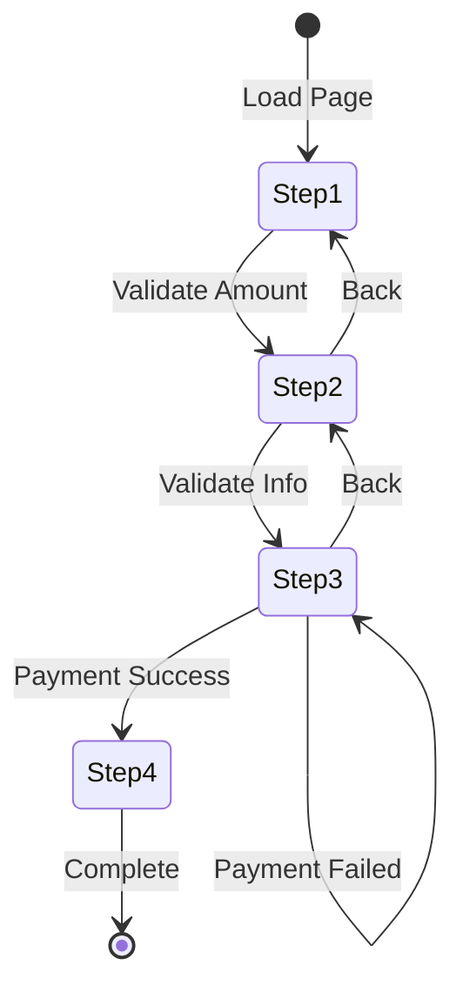
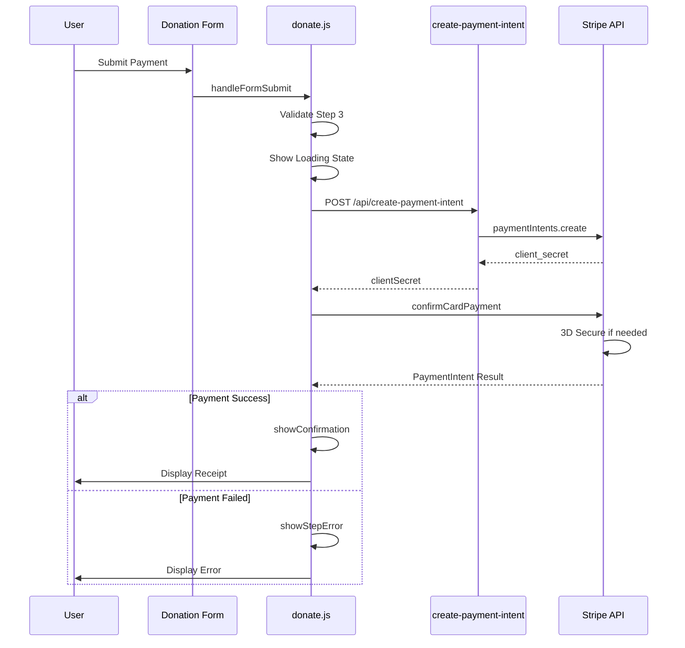
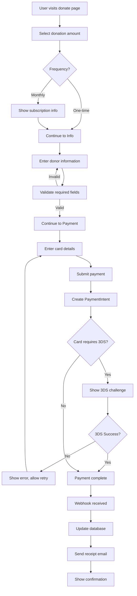

# Stripe Payment Integration Architecture

## Overview

This document outlines the comprehensive architecture for integrating Stripe payments into the Restored Kings Foundation website. The architecture is designed to be secure, scalable, and compliant with PCI-DSS requirements while providing an excellent donor experience.

---

## 1. System Architecture

### 1.1 High-Level Architecture Diagram



### 1.2 Component Overview

| Component | Location | Purpose |
|-----------|----------|---------|
| **Donation Form** | [`public/donate.html`](public/donate.html) | Multi-step form UI for donor information and payment |
| **Stripe Elements** | Stripe.js | Secure card input with PCI compliance |
| **donate.js** | [`public/js/donate.js`](public/js/donate.js) | Frontend payment logic and form handling |
| **create-payment-intent.js** | [`api/create-payment-intent.js`](api/create-payment-intent.js) | Serverless function to create Stripe PaymentIntents |
| **webhook-handler.js** | `api/webhook-handler.js` | Handle Stripe webhook events for payment confirmation |
| **Supabase** | External | Store donation records and donor information |

---

## 2. Backend Architecture

### 2.1 API Endpoints

#### 2.1.1 Create Payment Intent

**Endpoint:** `POST /api/create-payment-intent`

**Purpose:** Creates a Stripe PaymentIntent with the donation amount and donor metadata.

**Request:**
```json
{
  "amount": 10000,
  "currency": "usd",
  "donorEmail": "donor@example.com",
  "donorName": "John Doe",
  "donationType": "one-time",
  "saveCard": false
}
```

**Response - Success:**
```json
{
  "clientSecret": "pi_xxx_secret_xxx",
  "paymentIntentId": "pi_xxx"
}
```

**Response - Error:**
```json
{
  "error": "Error type",
  "message": "Detailed error message",
  "code": "ERROR_CODE"
}
```

**Validation Rules:**
| Field | Type | Required | Validation |
|-------|------|----------|------------|
| `amount` | integer | Yes | Minimum 100 cents - $1.00 |
| `currency` | string | No | Default: usd |
| `donorEmail` | string | No | Valid email format if provided |
| `donorName` | string | No | Max 255 characters |
| `donationType` | string | No | Enum: one-time, monthly |
| `saveCard` | boolean | No | Default: false |

**Current Implementation:** [`api/create-payment-intent.js`](api/create-payment-intent.js:1)

#### 2.1.2 Webhook Handler - NEW

**Endpoint:** `POST /api/webhook`

**Purpose:** Receives and processes Stripe webhook events for payment confirmation, failures, and disputes.

**Supported Events:**
| Event | Purpose |
|-------|---------|
| `payment_intent.succeeded` | Mark donation as complete, send receipt |
| `payment_intent.payment_failed` | Log failure, notify donor if possible |
| `charge.disputed` | Alert admin, track dispute |
| `charge.refunded` | Update donation status, log refund |

**Implementation Requirements:**
- Stripe signature verification using `STRIPE_WEBHOOK_SECRET`
- Idempotent event processing using event IDs
- Database transaction for data integrity

#### 2.1.3 Payment Confirmation - NEW

**Endpoint:** `POST /api/confirm-payment`

**Purpose:** Server-side payment confirmation for additional validation before completing donation.

**Request:**
```json
{
  "paymentIntentId": "pi_xxx",
  "donorInfo": {
    "name": "John Doe",
    "email": "donor@example.com",
    "address": {
      "line1": "123 Main St",
      "city": "Los Angeles",
      "state": "CA",
      "postal_code": "90001",
      "country": "US"
    }
  }
}
```

### 2.2 Serverless Function Structure

```
api/
├── create-payment-intent.js    # Existing - PaymentIntent creation
├── webhook-handler.js          # NEW - Stripe webhook processing
├── confirm-payment.js          # NEW - Payment confirmation
└── utils/
    ├── stripe.js               # NEW - Stripe client initialization
    ├── validation.js           # NEW - Input validation helpers
    └── response.js             # NEW - Standardized API responses
```

### 2.3 Security Headers

All API endpoints should include these security headers:

```javascript
res.setHeader('Content-Type', 'application/json');
res.setHeader('Access-Control-Allow-Origin', process.env.ALLOWED_ORIGIN || '*');
res.setHeader('Access-Control-Allow-Methods', 'POST, OPTIONS');
res.setHeader('Access-Control-Allow-Headers', 'Content-Type, Authorization, Stripe-Signature');
res.setHeader('X-Content-Type-Options', 'nosniff');
res.setHeader('X-Frame-Options', 'DENY');
res.setHeader('Strict-Transport-Security', 'max-age=31536000; includeSubDomains');
```

---

## 3. Frontend Architecture

### 3.1 Component Structure

The donation form follows a multi-step wizard pattern:



### 3.2 Step Components

#### Step 1: Amount Selection
**File:** [`public/donate.html`](public/donate.html:123) - Lines 123-213

**Features:**
- Preset amount buttons with impact descriptions
- Custom amount input
- One-time vs Monthly toggle
- Impact preview based on amount

**Validation:**
- Minimum amount: $1.00
- Maximum amount: $10,000 (configurable)
- Custom amount must be positive number

#### Step 2: Donor Information
**File:** [`public/donate.html`](public/donate.html:216) - Lines 216-308

**Fields:**
| Field | Required | Validation |
|-------|----------|------------|
| Full Name | Yes | Non-empty, max 255 chars |
| Email | Yes | Valid email format |
| Phone | No | Optional, phone format |
| Street Address | No | Optional |
| City | No | Optional |
| State | No | Optional |
| ZIP Code | No | Optional |
| Country | No | Default: US |

#### Step 3: Payment Details
**File:** [`public/donate.html`](public/donate.html:311) - Lines 311-432

**Components:**
- Donation summary card
- Cardholder name input
- Stripe Card Element for secure card input
- Billing address toggle
- Security badge and SSL indicator

#### Step 4: Confirmation
**File:** [`public/donate.html`](public/donate.html:435) - Lines 435-541

**Features:**
- Success animation
- Receipt summary
- Transaction ID display
- Print receipt option
- Social sharing buttons

### 3.3 Stripe Elements Integration

**Current Implementation:** [`public/js/donate.js`](public/js/donate.js:70) - `initializeStripe()`

```javascript
// Stripe Elements Configuration
const style = {
    base: {
        color: '#1a3a5c',
        fontFamily: '"Inter", -apple-system, BlinkMacSystemFont, sans-serif',
        fontSmoothing: 'antialiased',
        fontSize: '16px',
        '::placeholder': {
            color: '#94a3b8'
        }
    },
    invalid: {
        color: '#ef4444',
        iconColor: '#ef4444'
    }
};

// Card Element Options
const cardElementOptions = {
    style: style,
    hidePostalCode: true,  // We collect address separately
    disableLink: true      // Disable Stripe Links for simplicity
};
```

### 3.4 Payment Flow - Frontend

**Current Implementation:** [`public/js/donate.js`](public/js/donate.js:683) - `handleFormSubmit()`



### 3.5 Error Handling

**Error Types:**

| Error Type | User Message | Action |
|------------|--------------|--------|
| Card declined | Your card was declined. Please try a different card. | Allow retry |
| Insufficient funds | Insufficient funds. Please try a different card. | Allow retry |
| Invalid card number | Invalid card number. Please check and try again. | Allow retry |
| Expired card | Your card has expired. Please use a different card. | Allow retry |
| Network error | Unable to connect to payment service. Please try again. | Allow retry |
| 3D Secure failed | Authentication failed. Please try again. | Allow retry |
| Server error | An error occurred processing your donation. Please try again. | Allow retry |

**Current Implementation:** [`public/js/donate.js`](public/js/donate.js:763) - Error handling in `handleFormSubmit()`

---

## 4. Payment Flow

### 4.1 Complete Payment Flow



### 4.2 3D Secure - SCA Compliance

Strong Customer Authentication - SCA is handled automatically by Stripe:

1. **Detection:** Stripe determines if 3D Secure is required based on card issuer
2. **Challenge:** If required, Stripe.js handles the 3DS modal automatically
3. **Result:** PaymentIntent status updates to `succeeded` or requires further action

**Implementation:**
```javascript
const { error, paymentIntent } = await stripe.confirmCardPayment(clientSecret, {
    payment_method: {
        card: cardElement,
        billing_details: billingDetails
    }
});

// Handle 3D Secure
if (error) {
    // Show error to customer
} else if (paymentIntent.status === 'succeeded') {
    // Payment complete
} else if (paymentIntent.status === 'requires_action') {
    // 3D Secure handled automatically by Stripe.js
}
```

### 4.3 Payment States

| PaymentIntent Status | Description | UI Action |
|---------------------|-------------|-----------|
| `requires_payment_method` | Initial state, waiting for payment | Show payment form |
| `requires_confirmation` | Ready to confirm | Process confirmation |
| `requires_action` | 3D Secure required | Stripe.js handles modal |
| `processing` | Payment in progress | Show loading state |
| `succeeded` | Payment complete | Show confirmation |
| `canceled` | Payment canceled | Show cancellation message |
| `requires_capture` | Manual capture required | N/A for this implementation |

---

## 5. Security Architecture

### 5.1 PCI-DSS Compliance

**Compliance Level:** SAQ A - Simplified

Using Stripe Elements ensures the lowest PCI compliance burden:

| Requirement | Implementation |
|-------------|----------------|
| Card data never touches server | Stripe Elements iframes |
| HTTPS required | Enforced by Vercel |
| No card storage | Only store Stripe tokens/IDs |
| Secure transmission | TLS 1.2+ enforced |

**Key Points:**
- Card details are collected by Stripe Elements in secure iframes
- Only `paymentIntent.id` and `client_secret` are transmitted to/from server
- No card numbers, CVV, or expiration dates are logged or stored

### 5.2 API Key Management

**Environment Variables:**

| Variable | Purpose | Location |
|----------|---------|----------|
| `STRIPE_SECRET_KEY` | Server-side API calls | Vercel Environment Variables |
| `STRIPE_PUBLIC_KEY` | Client-side Stripe.js | Injected at build time |
| `STRIPE_WEBHOOK_SECRET` | Webhook signature verification | Vercel Environment Variables |

**Key Security:**
- Secret key NEVER exposed to client
- Public key is safe to expose in frontend code
- Webhook secret validates webhook authenticity
- Use test keys in development, live keys in production

**Current Configuration:** [`public/js/config.js`](public/js/config.js:8)

### 5.3 Webhook Signature Verification

**Implementation Required:**

```javascript
// In webhook-handler.js
const sig = req.headers['stripe-signature'];
const webhookSecret = process.env.STRIPE_WEBHOOK_SECRET;

let event;
try {
    event = stripe.webhooks.constructEvent(req.body, sig, webhookSecret);
} catch (err) {
    console.error('Webhook signature verification failed:', err.message);
    return res.status(400).send(`Webhook Error: ${err.message}`);
}
```

### 5.4 Amount Validation

**Server-Side Validation - Required:**

```javascript
// Validate amount is positive integer
if (!amount || amount < 100) {
    return res.status(400).json({
        error: 'Invalid amount',
        message: 'Minimum donation is $1.00 - 100 cents'
    });
}

// Maximum amount validation
const MAX_AMOUNT = 1000000; // $10,000
if (amount > MAX_AMOUNT) {
    return res.status(400).json({
        error: 'Invalid amount',
        message: 'Maximum single donation is $10,000'
    });
}

// Ensure amount is integer - no decimals
const validatedAmount = Math.round(amount);
```

**Current Implementation:** [`api/create-payment-intent.js`](api/create-payment-intent.js:41) - Lines 41-46

### 5.5 CSRF Protection

**Implementation:**

For serverless functions, CSRF protection is implemented via:

1. **Same-Origin Policy:** API only accepts requests from same origin
2. **Origin Header Validation:** Verify request origin matches allowed domains
3. **Stripe Signature:** Webhooks verified via Stripe signature

```javascript
// Origin validation middleware
const allowedOrigins = [
    'https://restoredkingsfoundation.org',
    'https://www.restoredkingsfoundation.org',
    process.env.VERCEL_URL ? `https://${process.env.VERCEL_URL}` : null
].filter(Boolean);

const origin = req.headers.origin;
if (!allowedOrigins.includes(origin)) {
    return res.status(403).json({ error: 'Forbidden' });
}
```

### 5.6 Rate Limiting

**Recommended Implementation:**

```javascript
// In-Memory rate limiting for serverless
const rateLimitMap = new Map();

function checkRateLimit(ip) {
    const now = Date.now();
    const windowMs = 60 * 1000; // 1 minute
    const maxRequests = 10; // Max 10 requests per minute
    
    const entry = rateLimitMap.get(ip) || { count: 0, resetTime: now + windowMs };
    
    if (now > entry.resetTime) {
        entry.count = 0;
        entry.resetTime = now + windowMs;
    }
    
    entry.count++;
    rateLimitMap.set(ip, entry);
    
    return entry.count <= maxRequests;
}
```

**Note:** For production, use Vercel Edge Config or Upstash Redis for distributed rate limiting.

---

## 6. Database Schema

### 6.1 Donations Table

```sql
CREATE TABLE donations (
    id UUID PRIMARY KEY DEFAULT gen_random_uuid(),
    stripe_payment_intent_id TEXT UNIQUE NOT NULL,
    stripe_charge_id TEXT,
    
    -- Amount and currency
    amount_cents INTEGER NOT NULL,
    currency TEXT DEFAULT 'usd',
    
    -- Donor information
    donor_name TEXT NOT NULL,
    donor_email TEXT NOT NULL,
    donor_phone TEXT,
    
    -- Address
    address_line1 TEXT,
    address_city TEXT,
    address_state TEXT,
    address_postal_code TEXT,
    address_country TEXT DEFAULT 'US',
    
    -- Donation details
    donation_type TEXT DEFAULT 'one-time' CHECK (donation_type IN ('one-time', 'monthly')),
    status TEXT DEFAULT 'pending' CHECK (status IN ('pending', 'succeeded', 'failed', 'refunded', 'disputed')),
    
    -- Metadata
    metadata JSONB DEFAULT '{}',
    
    -- Timestamps
    created_at TIMESTAMPTZ DEFAULT NOW(),
    updated_at TIMESTAMPTZ DEFAULT NOW(),
    completed_at TIMESTAMPTZ,
    
    -- Indexes
    INDEX idx_donations_email (donor_email),
    INDEX idx_donations_status (status),
    INDEX idx_donations_created (created_at)
);
```

### 6.2 Donors Table - Optional for donor management

```sql
CREATE TABLE donors (
    id UUID PRIMARY KEY DEFAULT gen_random_uuid(),
    email TEXT UNIQUE NOT NULL,
    name TEXT NOT NULL,
    phone TEXT,
    
    -- Address
    address_line1 TEXT,
    address_city TEXT,
    address_state TEXT,
    address_postal_code TEXT,
    address_country TEXT DEFAULT 'US',
    
    -- Stripe customer
    stripe_customer_id TEXT,
    
    -- Statistics
    total_donations INTEGER DEFAULT 0,
    total_amount_cents INTEGER DEFAULT 0,
    
    -- Timestamps
    first_donation_at TIMESTAMPTZ,
    last_donation_at TIMESTAMPTZ,
    created_at TIMESTAMPTZ DEFAULT NOW(),
    updated_at TIMESTAMPTZ DEFAULT NOW()
);
```

---

## 7. Email Integration

### 7.1 Receipt Email

**Trigger:** `payment_intent.succeeded` webhook event

**Template Variables:**
| Variable | Description |
|----------|-------------|
| `donor_name` | Donor full name |
| `amount` | Formatted donation amount |
| `date` | Donation date |
| `transaction_id` | Stripe PaymentIntent ID |
| `donation_type` | One-time or Monthly |
| `organization_name` | Restored Kings Foundation |
| `ein` | Tax ID for tax deduction |
| `receipt_url` | Link to online receipt |

### 7.2 Failed Payment Email

**Trigger:** `payment_intent.payment_failed` webhook event

**Purpose:** Notify donor of failed payment and suggest retry

### 7.3 Admin Notification

**Trigger:** Any donation event

**Purpose:** Notify admin team of new donations for record-keeping

---

## 8. Testing Strategy

### 8.1 Test Card Numbers

| Card Number | Scenario |
|-------------|----------|
| `4242 4242 4242 4242` | Successful payment |
| `4000 0000 0000 0002` | Decline - generic |
| `4000 0000 0000 9995` | Insufficient funds |
| `4000 0000 0000 0069` | Expired card |
| `4000 0000 0000 0127` | Incorrect CVC |
| `4000 0027 6000 3184` | 3D Secure required |
| `4000 0000 0000 3220` | 3D Secure with authentication |

**Test CVC:** Any 3 digits
**Test Expiry:** Any future date
**Test Postal Code:** Any 5 digits

### 8.2 Webhook Testing

**Local Development:**
```bash
# Install Stripe CLI
stripe login

# Forward webhooks to local server
stripe listen --forward-to localhost:3000/api/webhook
```

**Testing Events:**
```bash
# Trigger test webhook event
stripe trigger payment_intent.succeeded
```

### 8.3 Integration Tests

**Test Scenarios:**
- [ ] Successful one-time payment
- [ ] Successful payment with 3D Secure
- [ ] Failed payment - card declined
- [ ] Failed payment - insufficient funds
- [ ] Webhook event processing
- [ ] Receipt email sent
- [ ] Database record created
- [ ] Error handling and user feedback

---

## 9. Implementation Checklist

### Phase 1: Backend Foundation

- [ ] **Create webhook handler** - `api/webhook-handler.js`
  - [ ] Stripe signature verification
  - [ ] Event parsing and routing
  - [ ] Idempotent event processing
  - [ ] Error handling and logging

- [ ] **Create utility modules** - `api/utils/`
  - [ ] `stripe.js` - Stripe client initialization
  - [ ] `validation.js` - Input validation helpers
  - [ ] `response.js` - Standardized API responses

- [ ] **Enhance create-payment-intent.js**
  - [ ] Add maximum amount validation
  - [ ] Add origin validation
  - [ ] Add rate limiting
  - [ ] Improve error messages

### Phase 2: Database Integration

- [ ] **Create Supabase tables**
  - [ ] `donations` table with proper schema
  - [ ] `donors` table for donor management
  - [ ] Row Level Security policies

- [ ] **Integrate database in webhook handler**
  - [ ] Insert donation record on success
  - [ ] Update/create donor record
  - [ ] Handle duplicate events

### Phase 3: Email Integration

- [ ] **Configure SendGrid**
  - [ ] Create receipt email template
  - [ ] Create failed payment template
  - [ ] Set up sender authentication

- [ ] **Integrate email in webhook handler**
  - [ ] Send receipt on successful payment
  - [ ] Send notification on failed payment
  - [ ] Send admin notification

### Phase 4: Frontend Enhancements

- [ ] **Enhance error handling**
  - [ ] Map Stripe error codes to user-friendly messages
  - [ ] Add retry logic for network errors
  - [ ] Add loading states for all async operations

- [ ] **Add payment method options**
  - [ ] Apple Pay support
  - [ ] Google Pay support
  - [ ] Payment Request API

- [ ] **Improve accessibility**
  - [ ] ARIA labels for all form elements
  - [ ] Keyboard navigation
  - [ ] Screen reader announcements

### Phase 5: Security Hardening

- [ ] **Implement security measures**
  - [ ] Origin validation on all endpoints
  - [ ] Rate limiting
  - [ ] Request logging
  - [ ] Error monitoring

- [ ] **Security audit**
  - [ ] Review all API endpoints
  - [ ] Test webhook signature verification
  - [ ] Verify no sensitive data in logs

### Phase 6: Testing and Deployment

- [ ] **Write tests**
  - [ ] Unit tests for validation functions
  - [ ] Integration tests for API endpoints
  - [ ] E2E tests for payment flow

- [ ] **Deploy to production**
  - [ ] Set production environment variables
  - [ ] Configure Stripe webhook endpoint
  - [ ] Test with live Stripe keys - small amount
  - [ ] Monitor first transactions

---

## 10. Monitoring and Maintenance

### 10.1 Logging

**Log Events:**
- PaymentIntent creation
- Payment success/failure
- Webhook events received
- Database operations
- Email sending status
- Errors and exceptions

**Log Format:**
```javascript
{
    timestamp: '2024-01-15T10:30:00Z',
    level: 'info',
    event: 'payment_succeeded',
    paymentIntentId: 'pi_xxx',
    amount: 10000,
    donorEmail: 'donor@example.com'
}
```

### 10.2 Monitoring Alerts

| Alert | Threshold | Action |
|-------|-----------|--------|
| Payment failure rate | > 5% | Investigate immediately |
| Webhook failures | Any | Check Stripe dashboard |
| API response time | > 3 seconds | Optimize or scale |
| Database errors | Any | Check Supabase status |

### 10.3 Regular Maintenance

- [ ] **Weekly:** Review failed payments
- [ ] **Monthly:** Reconcile Stripe balance with database
- [ ] **Quarterly:** Review and rotate API keys
- [ ] **Annually:** PCI compliance self-assessment

---

## 11. Future Enhancements

### 11.1 Recurring Donations

- Implement Stripe Subscriptions for monthly giving
- Create subscription management portal
- Handle subscription lifecycle events

### 11.2 Donor Portal

- View donation history
- Download tax receipts
- Manage recurring donations
- Update payment methods

### 11.3 Additional Payment Methods

- ACH bank transfers
- PayPal integration
- Cryptocurrency donations
- Bank wire transfers for large donations

### 11.4 Analytics Integration

- Track conversion funnel
- Monitor abandonment rates
- A/B test donation amounts
- Integrate with Google Analytics

---

## Appendix A: Environment Variables

```bash
# Stripe Configuration
STRIPE_SECRET_KEY=sk_live_xxx           # Production secret key
STRIPE_PUBLIC_KEY=pk_live_xxx           # Production public key
STRIPE_WEBHOOK_SECRET=whsec_xxx         # Webhook signing secret

# Test Mode
STRIPE_TEST_SECRET_KEY=sk_test_xxx      # Test secret key
STRIPE_TEST_PUBLIC_KEY=pk_test_xxx      # Test public key
STRIPE_TEST_WEBHOOK_SECRET=whsec_xxx    # Test webhook secret

# Database
SUPABASE_URL=https://xxx.supabase.co
SUPABASE_SERVICE_KEY=eyJxxx             # Service role key for serverless

# Email
SENDGRID_API_KEY=SG.xxx
SENDGRID_FROM_EMAIL=noreply@restoredkings.org
ADMIN_EMAIL=admin@restoredkings.org

# Security
ALLOWED_ORIGINS=https://restoredkingsfoundation.org,https://www.restoredkingsfoundation.org
```

---

## Appendix B: Stripe Dashboard Configuration

### Webhook Endpoint Setup

1. Navigate to Developers → Webhooks in Stripe Dashboard
2. Add endpoint: `https://restoredkingsfoundation.org/api/webhook`
3. Select events to listen to:
   - `payment_intent.succeeded`
   - `payment_intent.payment_failed`
   - `charge.disputed`
   - `charge.refunded`
4. Copy signing secret to `STRIPE_WEBHOOK_SECRET`

### Payment Settings

1. Enable 3D Secure for all transactions
2. Configure radar rules for fraud prevention
3. Set up email receipts in Stripe - optional, we send our own
4. Configure business branding for Stripe-hosted pages

---

## Appendix C: Error Codes Reference

| Code | Description | User Message |
|------|-------------|--------------|
| `STRIPE_NOT_CONFIGURED` | Missing API key | Payment processing is not configured |
| `STRIPE_AUTH_ERROR` | Invalid API key | Payment service configuration error |
| `INVALID_AMOUNT` | Amount validation failed | Please enter a valid donation amount |
| `CARD_DECLINED` | Card was declined | Your card was declined. Please try a different card. |
| `INSUFFICIENT_FUNDS` | Not enough balance | Insufficient funds. Please try a different card. |
| `EXPIRED_CARD` | Card has expired | Your card has expired. Please use a different card. |
| `INCORRECT_CVC` | Wrong CVC entered | Incorrect security code. Please check and try again. |
| `PROCESSING_ERROR` | Generic processing error | An error occurred processing your payment. Please try again. |
