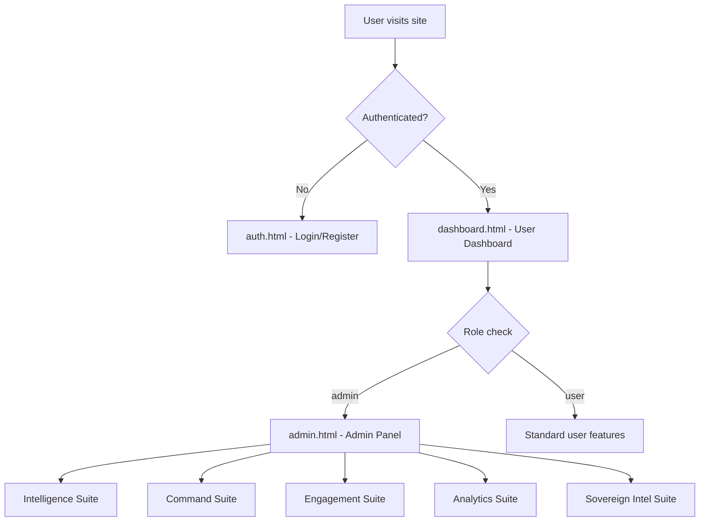
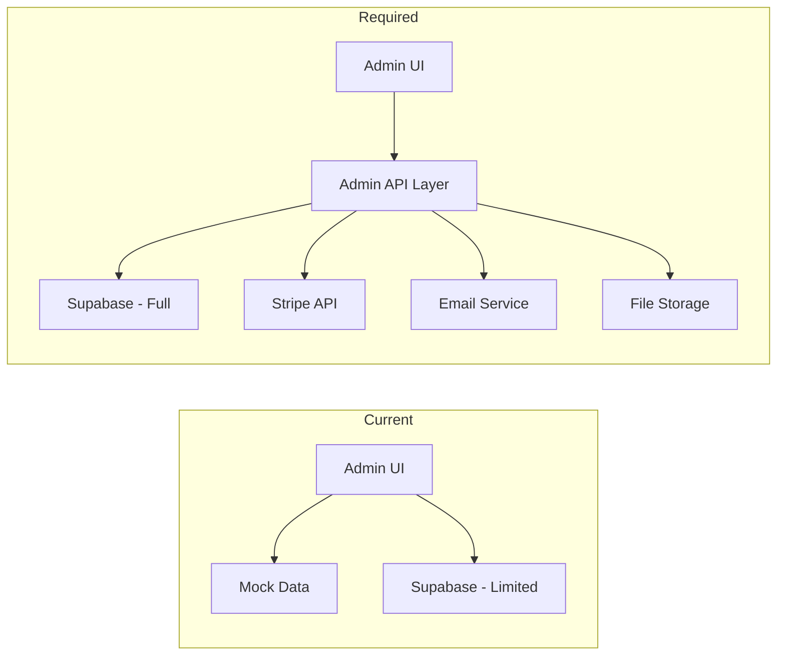
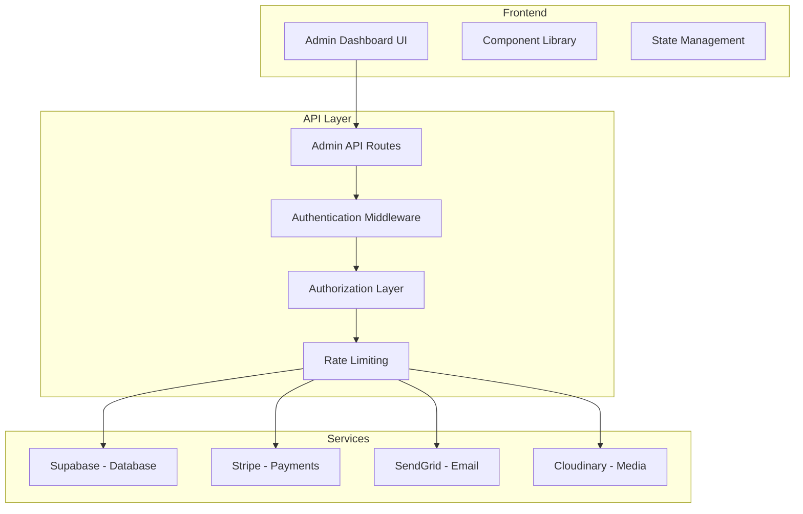
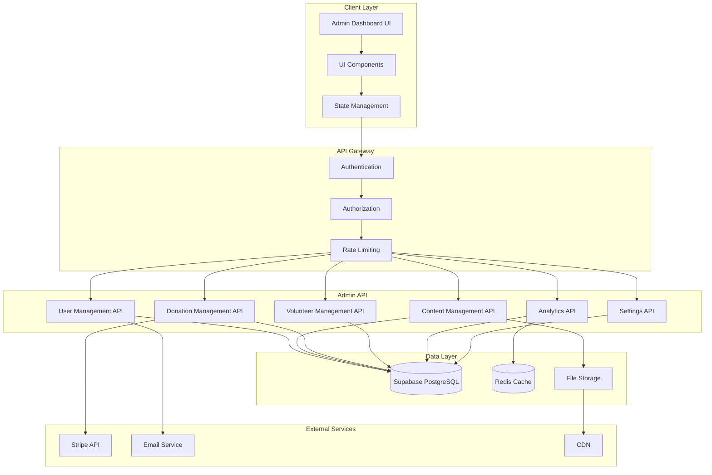
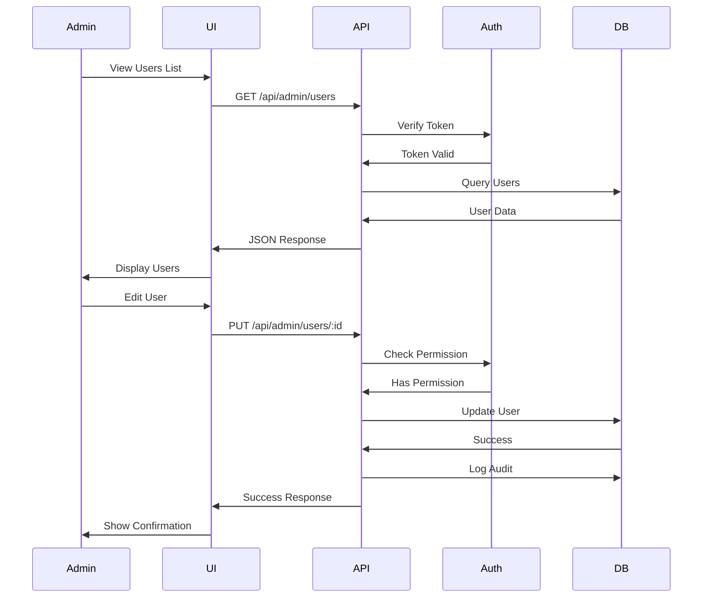

# Admin Dashboard Analysis and Comprehensive Design

## Executive Summary

This document provides a detailed analysis of the existing admin dashboard implementation for the Restored Kings Foundation website and presents a comprehensive design for a full-featured admin dashboard system.

---

## Part 1: Current State Analysis

### 1.1 Existing Admin Files

The project currently has **two separate admin implementations**:

#### Primary Admin Interface: [`public/admin.html`](public/admin.html)
- **Purpose**: Command Center style admin interface
- **Style**: Dark theme with glass-panel design, premium UI
- **Navigation**: Sidebar with 5 command suites
- **Features Implemented**:
  - Intelligence Suite with Chart.js visualizations
  - Impact Growth Velocity chart
  - Heatmap/Radar visualization
  - Predictive Funding display
  - Foundation Vital Signs audit log
  - Success Matrix KPIs
  - Command & Control suite with bulk outreach
  - Lifecycle Forge for project management
  - Engagement Suite with volunteer funnel
  - Sentiment Matrix display
  - Field Media Portal placeholder
  - Legacy Pipeline tracking
  - Health Triage system status
  - Omni-search with keyboard shortcut

#### Secondary Admin Interface: [`backend/admin/index.html`](backend/admin/index.html)
- **Purpose**: Traditional admin panel template
- **Style**: Light theme, conventional dashboard layout
- **Status**: Placeholder/Template only
- **Features Shown**:
  - Dashboard stats cards
  - Recent donations table
  - Pending volunteer applications table
  - Implementation needed notice

### 1.2 Authentication System

#### Current Auth Implementation: [`public/js/auth.js`](public/js/auth.js)
- **Provider**: Supabase Authentication
- **Features**:
  - Login/Register tab switching
  - Password strength indicator
  - Profile creation on registration
  - Session management

#### Auth Helper Module: [`public/js/supabase.js`](public/js/supabase.js)
```javascript
// Available methods:
auth.signUp(email, password)
auth.signIn(email, password)
auth.signOut()
auth.getUser()
```

### 1.3 Database Schema - Inferred from Code

Based on the code analysis, the following Supabase tables exist or are expected:

| Table | Purpose | Fields Inferred |
|-------|---------|-----------------|
| `profiles` | User profiles | id, full_name, email, role, total_donated, volunteer_hours, lives_impacted, skills |
| `donations` | Donation records | id, user_id, amount, type, created_at |
| `projects` | Volunteer projects | id, title, description, status, location |
| `volunteer_tasks` | Task assignments | id, user_id, project_title, status |

### 1.4 API Endpoints

| Endpoint | File | Purpose |
|----------|------|---------|
| `/api/create-payment-intent` | [`api/create-payment-intent.js`](api/create-payment-intent.js) | Stripe payment creation |
| `/api/confirm-payment` | [`api/confirm-payment.js`](api/confirm-payment.js) | Payment confirmation |
| `/api/webhook` | [`api/webhook.js`](api/webhook.js) | Stripe webhook handler |
| `/api/verify-card` | [`api/verify-card.js`](api/verify-card.js) | Card verification |
| `/api/stripe-config` | [`api/stripe-config.js`](api/stripe-config.js) | Stripe utilities |

### 1.5 Role-Based Access Control - Current State

From [`public/js/admin.js`](public/js/admin.js:22-28):
```javascript
// Check for admin role
const { data: profile } = await db.getProfile(user.id);
if (profile && profile.role !== 'admin') {
    showNotification('Access denied. Admin privileges required.', 'error');
    setTimeout(() => window.location.href = '/dashboard.html', 2000);
    return;
}
```

**Current Implementation**:
- Single role check: `role === 'admin'`
- No granular permissions
- No role hierarchy
- Redirects non-admin users

---

## Part 2: Access Points Documentation

### 2.1 Current Access Points



### 2.2 Entry URLs

| URL | Access Level | Description |
|-----|--------------|-------------|
| `/auth.html` | Public | Login/Register page |
| `/dashboard.html` | Authenticated | User dashboard |
| `/admin.html` | Admin only | Command Center |
| `/backend/admin/index.html` | Unknown | Placeholder admin |

### 2.3 Authentication Flow

1. User visits `/auth.html`
2. Enters credentials
3. Supabase validates and creates session
4. Redirects to `/dashboard.html`
5. Dashboard checks user role
6. If admin, shows link to admin panel
7. Admin panel performs secondary role check

---

## Part 3: Gap Analysis

### 3.1 Missing Features

| Feature | Current State | Required |
|---------|---------------|----------|
| User Management | Not implemented | CRUD operations for users |
| Content Management | Not implemented | Blog, pages, programs |
| Donation Management | Display only | Full management, refunds |
| Volunteer Management | Display only | Application review, assignment |
| Analytics | Mock data | Real data integration |
| Settings | Not implemented | Site configuration |
| Role Management | Single role | Granular permissions |
| Audit Logging | Mock display | Real audit trail |
| Notifications | Alert-based | Email/system notifications |
| File Management | Not implemented | Media library |

### 3.2 Security Gaps

1. **No CSRF protection** on forms
2. **No rate limiting** on admin actions
3. **No session timeout** enforcement
4. **No audit trail** for admin actions
5. **No IP whitelisting** option
6. **No 2FA** for admin accounts

### 3.3 Data Flow Gaps



---

## Part 4: Comprehensive Admin Dashboard Design

### 4.1 Proposed Architecture



### 4.2 Module Design

#### Module 1: User Management

**Features**:
- User listing with search/filter
- User detail view
- Edit user profile
- Delete/deactivate user
- Role assignment
- Activity history

**Database Schema**:
```sql
-- Extended profiles table
ALTER TABLE profiles ADD COLUMN phone VARCHAR(20);
ALTER TABLE profiles ADD COLUMN avatar_url TEXT;
ALTER TABLE profiles ADD COLUMN status VARCHAR(20) DEFAULT 'active';
ALTER TABLE profiles ADD COLUMN last_login TIMESTAMP;
ALTER TABLE profiles ADD COLUMN created_at TIMESTAMP DEFAULT NOW();
ALTER TABLE profiles ADD COLUMN updated_at TIMESTAMP DEFAULT NOW();

-- Role definitions table
CREATE TABLE roles (
    id UUID PRIMARY KEY DEFAULT gen_random_uuid(),
    name VARCHAR(50) UNIQUE NOT NULL,
    description TEXT,
    permissions JSONB DEFAULT '{}',
    created_at TIMESTAMP DEFAULT NOW()
);

-- User role assignments
CREATE TABLE user_roles (
    user_id UUID REFERENCES auth.users(id),
    role_id UUID REFERENCES roles(id),
    assigned_by UUID REFERENCES auth.users(id),
    assigned_at TIMESTAMP DEFAULT NOW(),
    PRIMARY KEY (user_id, role_id)
);
```

**API Endpoints**:
| Method | Endpoint | Description |
|--------|----------|-------------|
| GET | `/api/admin/users` | List users with pagination |
| GET | `/api/admin/users/:id` | Get user details |
| PUT | `/api/admin/users/:id` | Update user |
| DELETE | `/api/admin/users/:id` | Deactivate user |
| POST | `/api/admin/users/:id/roles` | Assign role |

#### Module 2: Content Management

**Features**:
- Blog post management - CRUD
- Page content editor
- Program management
- Impact stories
- Media library integration

**Database Schema**:
```sql
-- Blog posts
CREATE TABLE blog_posts (
    id UUID PRIMARY KEY DEFAULT gen_random_uuid(),
    title VARCHAR(255) NOT NULL,
    slug VARCHAR(255) UNIQUE NOT NULL,
    content TEXT,
    excerpt TEXT,
    featured_image_url TEXT,
    author_id UUID REFERENCES auth.users(id),
    status VARCHAR(20) DEFAULT 'draft',
    published_at TIMESTAMP,
    created_at TIMESTAMP DEFAULT NOW(),
    updated_at TIMESTAMP DEFAULT NOW()
);

-- Programs
CREATE TABLE programs (
    id UUID PRIMARY KEY DEFAULT gen_random_uuid(),
    title VARCHAR(255) NOT NULL,
    description TEXT,
    image_url TEXT,
    status VARCHAR(20) DEFAULT 'active',
    sort_order INT DEFAULT 0,
    created_at TIMESTAMP DEFAULT NOW(),
    updated_at TIMESTAMP DEFAULT NOW()
);

-- Impact stories
CREATE TABLE impact_stories (
    id UUID PRIMARY KEY DEFAULT gen_random_uuid(),
    title VARCHAR(255) NOT NULL,
    content TEXT,
    beneficiary_name VARCHAR(255),
    image_url TEXT,
    program_id UUID REFERENCES programs(id),
    status VARCHAR(20) DEFAULT 'draft',
    published_at TIMESTAMP,
    created_at TIMESTAMP DEFAULT NOW()
);
```

#### Module 3: Donation Management

**Features**:
- Donation listing with filters
- Donation detail view
- Refund processing
- Recurring donation management
- Donation reports
- Tax receipt generation

**Database Schema**:
```sql
-- Donations - extended
ALTER TABLE donations ADD COLUMN stripe_payment_intent_id VARCHAR(255);
ALTER TABLE donations ADD COLUMN stripe_charge_id VARCHAR(255);
ALTER TABLE donations ADD COLUMN status VARCHAR(20) DEFAULT 'pending';
ALTER TABLE donations ADD COLUMN currency VARCHAR(3) DEFAULT 'usd';
ALTER TABLE donations ADD COLUMN donor_email VARCHAR(255);
ALTER TABLE donations ADD COLUMN donor_name VARCHAR(255);
ALTER TABLE donations ADD COLUMN is_recurring BOOLEAN DEFAULT FALSE;
ALTER TABLE donations ADD COLUMN recurring_interval VARCHAR(20);
ALTER TABLE donations ADD COLUMN refunded_at TIMESTAMP;
ALTER TABLE donations ADD COLUMN refund_reason TEXT;

-- Donation refunds
CREATE TABLE donation_refunds (
    id UUID PRIMARY KEY DEFAULT gen_random_uuid(),
    donation_id UUID REFERENCES donations(id),
    amount INTEGER,
    reason TEXT,
    processed_by UUID REFERENCES auth.users(id),
    stripe_refund_id VARCHAR(255),
    created_at TIMESTAMP DEFAULT NOW()
);
```

#### Module 4: Volunteer Management

**Features**:
- Application review workflow
- Volunteer directory
- Task/project assignment
- Hours tracking
- Communication tools

**Database Schema**:
```sql
-- Volunteer applications
CREATE TABLE volunteer_applications (
    id UUID PRIMARY KEY DEFAULT gen_random_uuid(),
    user_id UUID REFERENCES auth.users(id),
    interest_area VARCHAR(100),
    experience TEXT,
    availability TEXT,
    status VARCHAR(20) DEFAULT 'pending',
    reviewed_by UUID REFERENCES auth.users(id),
    reviewed_at TIMESTAMP,
    notes TEXT,
    created_at TIMESTAMP DEFAULT NOW()
);

-- Volunteer hours
CREATE TABLE volunteer_hours (
    id UUID PRIMARY KEY DEFAULT gen_random_uuid(),
    user_id UUID REFERENCES auth.users(id),
    project_id UUID REFERENCES projects(id),
    hours DECIMAL(4,2),
    date DATE,
    description TEXT,
    approved_by UUID REFERENCES auth.users(id),
    approved_at TIMESTAMP,
    created_at TIMESTAMP DEFAULT NOW()
);
```

#### Module 5: Analytics & Reporting

**Features**:
- Dashboard with KPIs
- Donation trends
- User engagement metrics
- Volunteer statistics
- Custom report builder
- Export functionality

**Implementation**:
- Integrate with Supabase for real-time data
- Add Chart.js or similar for visualizations
- Create scheduled jobs for report generation
- Implement CSV/PDF export

#### Module 6: Settings & Configuration

**Features**:
- Site settings - name, description, contact
- Email templates
- Payment configuration
- Feature flags
- Maintenance mode

**Database Schema**:
```sql
-- Site settings
CREATE TABLE site_settings (
    key VARCHAR(100) PRIMARY KEY,
    value TEXT,
    description TEXT,
    updated_at TIMESTAMP DEFAULT NOW(),
    updated_by UUID REFERENCES auth.users(id)
);

-- Email templates
CREATE TABLE email_templates (
    id UUID PRIMARY KEY DEFAULT gen_random_uuid(),
    name VARCHAR(100) NOT NULL,
    subject VARCHAR(255),
    body TEXT,
    variables JSONB,
    created_at TIMESTAMP DEFAULT NOW(),
    updated_at TIMESTAMP DEFAULT NOW()
);
```

#### Module 7: Role-Based Access Control

**Features**:
- Role definition
- Permission management
- Role assignment UI
- Access logging

**Permission Matrix**:
| Role | Users | Content | Donations | Volunteers | Settings |
|------|-------|---------|-----------|------------|----------|
| super_admin | Full | Full | Full | Full | Full |
| admin | View/Edit | Full | View/Edit | Full | View |
| content_manager | - | Full | View | - | - |
| donation_manager | View | - | Full | - | - |
| volunteer_coordinator | View | - | - | Full | - |
| viewer | View | View | View | View | - |

**Database Schema**:
```sql
-- Permissions
CREATE TABLE permissions (
    id UUID PRIMARY KEY DEFAULT gen_random_uuid(),
    name VARCHAR(100) UNIQUE NOT NULL,
    description TEXT,
    module VARCHAR(50)
);

-- Role permissions
CREATE TABLE role_permissions (
    role_id UUID REFERENCES roles(id),
    permission_id UUID REFERENCES permissions(id),
    PRIMARY KEY (role_id, permission_id)
);

-- Audit log
CREATE TABLE admin_audit_log (
    id UUID PRIMARY KEY DEFAULT gen_random_uuid(),
    user_id UUID REFERENCES auth.users(id),
    action VARCHAR(100) NOT NULL,
    entity_type VARCHAR(50),
    entity_id UUID,
    old_values JSONB,
    new_values JSONB,
    ip_address VARCHAR(45),
    user_agent TEXT,
    created_at TIMESTAMP DEFAULT NOW()
);
```

---

## Part 5: Implementation Recommendations

### 5.1 Phase 1: Foundation - Priority: Critical

1. **Consolidate Admin Interfaces**
   - Choose single admin approach - recommend Command Center style
   - Remove duplicate [`backend/admin/index.html`](backend/admin/index.html)
   - Establish consistent routing

2. **Implement Admin API Layer**
   - Create `/api/admin/*` endpoints
   - Add authentication middleware
   - Implement authorization checks

3. **Extend Database Schema**
   - Create missing tables
   - Add audit logging
   - Set up Row Level Security

### 5.2 Phase 2: Core Features - Priority: High

1. **User Management Module**
   - User listing and search
   - Profile editing
   - Role assignment

2. **Donation Management Module**
   - Real data integration
   - Refund capability
   - Receipt generation

3. **Content Management Module**
   - Blog management
   - Program pages
   - Impact stories

### 5.3 Phase 3: Advanced Features - Priority: Medium

1. **Volunteer Management**
   - Application workflow
   - Hour tracking
   - Assignment system

2. **Analytics Dashboard**
   - Real metrics
   - Visualizations
   - Export capability

3. **Settings & Configuration**
   - Site settings
   - Email templates
   - Feature flags

### 5.4 Phase 4: Security & Polish - Priority: High

1. **Security Enhancements**
   - Implement rate limiting
   - Add CSRF protection
   - Enable 2FA for admins
   - Session management

2. **Audit & Compliance**
   - Comprehensive audit logging
   - Data export for compliance
   - Privacy controls

### 5.5 Technical Recommendations

| Area | Recommendation |
|------|----------------|
| **Framework** | Continue with vanilla JS or migrate to React/Vue for complex UI |
| **State Management** | Implement proper state management for admin |
| **API Design** | RESTful with proper versioning - `/api/v1/admin/` |
| **Authentication** | Enhance Supabase auth with custom claims for roles |
| **Caching** | Implement Redis for session and data caching |
| **File Storage** | Use Supabase Storage or Cloudinary for media |
| **Email** | Integrate SendGrid or similar for notifications |
| **Monitoring** | Add error tracking with Sentry |
| **Testing** | Implement E2E tests for critical admin flows |

---

## Part 6: UI/UX Design Recommendations

### 6.1 Dashboard Layout

```
┌─────────────────────────────────────────────────────────────┐
│  HEADER: Logo | Search | Notifications | User Menu          │
├──────────┬──────────────────────────────────────────────────┤
│          │                                                   │
│  SIDEBAR │  MAIN CONTENT AREA                                │
│          │                                                   │
│  - Home  │  ┌─────────────────────────────────────────────┐ │
│  - Users │  │ Page Title                    [+ Add] [⚙]   │ │
│  - Content│  ├─────────────────────────────────────────────┤ │
│  - Donations│ │                                             │ │
│  - Volunteers│ │  Content specific to selected menu item   │ │
│  - Analytics│ │                                             │ │
│  - Settings│ │                                             │ │
│          │  │                                             │ │
│          │  └─────────────────────────────────────────────┘ │
│          │                                                   │
├──────────┴──────────────────────────────────────────────────┤
│  FOOTER: Version | Help | Status                            │
└─────────────────────────────────────────────────────────────┘
```

### 6.2 Key UI Components

1. **Data Tables** - Sortable, filterable, paginated
2. **Form Builder** - Dynamic forms with validation
3. **Modal System** - Confirmations, quick edits
4. **Notification System** - Toast notifications
5. **Search** - Global search across entities
6. **Filters** - Advanced filtering for lists
7. **Export** - CSV/PDF export buttons
8. **Activity Feed** - Recent actions timeline

---

## Part 7: Security Checklist

- [ ] Implement rate limiting on all admin endpoints
- [ ] Add CSRF tokens to all forms
- [ ] Enable Row Level Security in Supabase
- [ ] Implement session timeout with refresh
- [ ] Add IP-based access logging
- [ ] Enable 2FA for admin accounts
- [ ] Encrypt sensitive data at rest
- [ ] Implement secure password reset flow
- [ ] Add brute force protection
- [ ] Regular security audits

---

## Appendix A: File Reference

| File | Purpose | Lines |
|------|---------|-------|
| [`public/admin.html`](public/admin.html) | Command Center UI | 380 |
| [`public/js/admin.js`](public/js/admin.js) | Admin functionality | 235 |
| [`backend/admin/index.html`](backend/admin/index.html) | Placeholder admin | 389 |
| [`public/js/auth.js`](public/js/auth.js) | Authentication | 108 |
| [`public/js/dashboard.js`](public/js/dashboard.js) | User dashboard | 341 |
| [`public/js/supabase.js`](public/js/supabase.js) | Database helpers | 40 |
| [`api/stripe-config.js`](api/stripe-config.js) | Stripe utilities | 364 |
| [`api/create-payment-intent.js`](api/create-payment-intent.js) | Payment creation | 455 |
| [`api/webhook.js`](api/webhook.js) | Stripe webhooks | 374 |

---

## Appendix B: Mermaid Diagrams

### Admin Dashboard Architecture



### User Management Flow



---

*Document Version: 1.0*
*Created: 2026-02-23*
*Author: Architect Mode Analysis*
